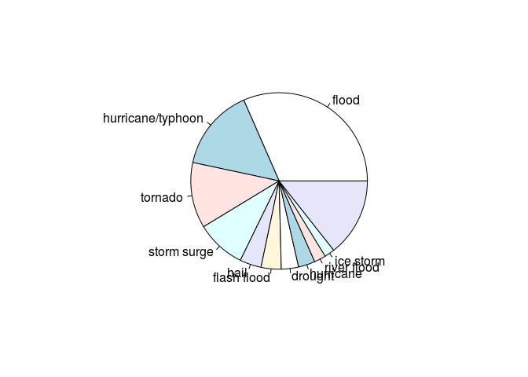
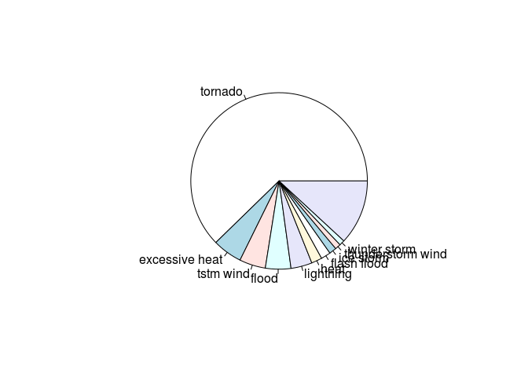

# RepData_PeerAssessment2
Andre Bandarra  
17-10-2014  
#Introduction

 - National Weather Service Storm Data Documentation[https://d396qusza40orc.cloudfront.net/repdata%2Fpeer2_doc%2Fpd01016005curr.pdf]
 - National Climatic Data Center Storm Events FAQ[https://d396qusza40orc.cloudfront.net/repdata%2Fpeer2_doc%2FNCDC%20Storm%20Events-FAQ%20Page.pdf]


Download the Storm Data file to the *data* directory.

```r
url <- "https://d396qusza40orc.cloudfront.net/repdata%2Fdata%2FStormData.csv.bz2";
localfile <- "data/stormdata.csv.bz2";

if (!file.exists("data")){
    dir.create("data")
}
download.file(url, localfile,method="curl")
```

#Processing the Data File

Read the data from the bzile

```r
stormdata <- read.csv(bzfile(localfile))
```

Make the dataset tidy by transforming the column names to lowercase.

```r
colnames(stormdata) <-tolower(colnames(stormdata))
```

Create a new dataset, containing only the rows that have property damage, crop damage, injury or fatality. Also, preserve only the columns that have information about the event type, property damage, crop damage, injury and fatality.

```r
damageInjurydata <- stormdata[stormdata$propdmg > 0 | stormdata$cropdmg > 0
                              | stormdata$fatalities > 0 | stormdata$injuries > 0, c(8,23,24,25,26,27,28)]
```

Transform the propdmbexp, cropdmgexp and evtype to lowercase, trim and transform them to factors.

```r
damageInjurydata$evtype <- as.factor(gsub("^\\s+|\\s+$", "",tolower(damageInjurydata$evtype)))

damageInjurydata$propdmgexp <- as.factor(gsub("^\\s+|\\s+$", "",tolower(damageInjurydata$propdmgexp)))

damageInjurydata$cropdmgexp <- as.factor(gsub("^\\s+|\\s+$", "",tolower(damageInjurydata$cropdmgexp)))
```

The documentations describes that on the damage columns (cropdmg and cropdmg), the variable stores the 3 most significant digits from the value. cropdmgexp and propdmgexp describe the magnitude of the values, such that:

- "k" equals thousants
- "m" equals millions
- "b" equals billions.

Transform the values to the correct magnitude


```r
damageInjurydata$propdmg[damageInjurydata$propdmgexp == 'k'] <- damageInjurydata$propdmg[damageInjurydata$propdmgexp == 'k'] * 1000

damageInjurydata$propdmg[damageInjurydata$propdmgexp == 'm'] <- damageInjurydata$propdmg[damageInjurydata$propdmgexp == 'm'] * 1000000

damageInjurydata$propdmg[damageInjurydata$propdmgexp == 'b'] <- damageInjurydata$propdmg[damageInjurydata$propdmgexp == 'b'] * 1000000000


damageInjurydata$cropdmg[damageInjurydata$cropdmgexp == 'k'] <- damageInjurydata$cropdmg[damageInjurydata$cropdmgexp == 'k'] * 1000

damageInjurydata$cropdmg[damageInjurydata$cropdmgexp == 'm'] <- damageInjurydata$cropdmg[damageInjurydata$cropdmgexp == 'm'] * 1000000

damageInjurydata$cropdmg[damageInjurydata$cropdmgexp == 'b'] <- damageInjurydata$cropdmg[damageInjurydata$cropdmgexp == 'b'] * 1000000000
```


Sum the crop damage data with the property damage data, so as to get the total damage. Also, sum the number of injuries and the number of fatalities to calculate to total human loss.

```r
damageInjurydata$totaldmg <- damageInjurydata$cropdmg + damageInjurydata$propdmg;
damageInjurydata$totalHumanLoss <- damageInjurydata$injuries + damageInjurydata$fatalities;
```

Aggregation the total human losses and total damage by event type.

```r
lossbyevttype <- aggregate(cbind(totalHumanLoss, totaldmg) ~ evtype, damageInjurydata, FUN=sum)

summary(lossbyevttype)
```

```
##                     evtype    totalHumanLoss     totaldmg       
##  ?                     :  1   Min.   :    0   Min.   :0.00e+00  
##  agricultural freeze   :  1   1st Qu.:    0   1st Qu.:5.00e+03  
##  apache county         :  1   Median :    0   Median :1.00e+05  
##  astronomical high tide:  1   Mean   :  351   Mean   :1.07e+09  
##  astronomical low tide :  1   3rd Qu.:    5   3rd Qu.:5.00e+06  
##  avalance              :  1   Max.   :96979   Max.   :1.50e+11  
##  (Other)               :438
```


```r
sortedDmg <- lossbyevttype[order(lossbyevttype$totaldmg, decreasing=T),]

sorterHuman <- lossbyevttype[order(lossbyevttype$totalHumanLoss, decreasing=T),]


##Damage Pie
top10Dmg <- sortedDmg[c(1:10),]

nrows <- length(sortedDmg[,1])

othersDmg <- sum(sortedDmg$totaldmg[11:nrows])
othersInjuries <- sum(sortedDmg$totalHumanLoss[11:nrows])

top10Dmg <- rbind(top10Dmg, c("others", othersInjuries, othersDmg))
```

```
## Warning: invalid factor level, NA generated
```

```r
pie(as.numeric(top10Dmg$totaldmg), labels=top10Dmg$evtype)
```

 

```r
#Injuries Pie
top10Inj <- sorterHuman[c(1:10),]
othersDmg <- sum(sorterHuman$totaldmg[11:nrows])
othersInjuries <- sum(sorterHuman$totalHumanLoss[11:nrows])

top10DInj <- rbind(top10Inj, c("others", othersInjuries, othersDmg))
```

```
## Warning: invalid factor level, NA generated
```

```r
pie(as.numeric(top10DInj$totalHumanLoss), labels=top10DInj$evtype)
```

 


