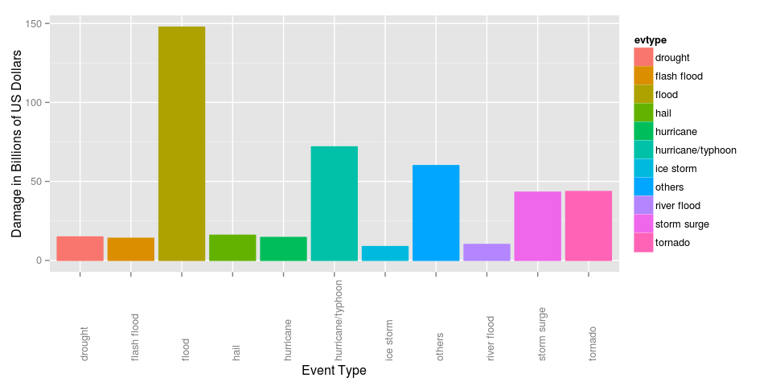

# Comparison of Economic and Public Health Damages on the NOAA storm database
Andre Bandarra  
22-10-2014  
#Introduction

The objective of this analysis is provide a brief comparison of the economic and public health damage caused by events on the U.S. National Oceanic and Atmospheric Administration's (NOAA) storm database.

We show the top 10 causes for economic damage and the top 10 causes for public health damage, and compare the biggest causes of each one. 

More information on the original database can be found on the following URLs:
 - National Weather Service Storm Data Documentation[https://d396qusza40orc.cloudfront.net/repdata%2Fpeer2_doc%2Fpd01016005curr.pdf]
 - National Climatic Data Center Storm Events FAQ[https://d396qusza40orc.cloudfront.net/repdata%2Fpeer2_doc%2FNCDC%20Storm%20Events-FAQ%20Page.pdf]


#Processing the Data File

Download the Storm Data file to the *data* directory.

```r
url <- "https://d396qusza40orc.cloudfront.net/repdata%2Fdata%2FStormData.csv.bz2";
localfile <- "data/stormdata.csv.bz2";

if (!file.exists("data")){
    dir.create("data")
}

if (!file.exists(localfile)) {
    download.file(url, localfile,method="curl")    
}
```


Read the data from the bzfile

```r
stormdata <- read.csv(bzfile(localfile))
```

Make the column names of the dataset tidy by transforming the column names to lowercase.

```r
colnames(stormdata) <-tolower(colnames(stormdata))
colnames(stormdata)
```

```
##  [1] "state__"    "bgn_date"   "bgn_time"   "time_zone"  "county"    
##  [6] "countyname" "state"      "evtype"     "bgn_range"  "bgn_azi"   
## [11] "bgn_locati" "end_date"   "end_time"   "county_end" "countyendn"
## [16] "end_range"  "end_azi"    "end_locati" "length"     "width"     
## [21] "f"          "mag"        "fatalities" "injuries"   "propdmg"   
## [26] "propdmgexp" "cropdmg"    "cropdmgexp" "wfo"        "stateoffic"
## [31] "zonenames"  "latitude"   "longitude"  "latitude_e" "longitude_"
## [36] "remarks"    "refnum"
```

Create a new dataset, containing only the rows that have property damage, crop damage, injury or fatality. Also, preserve only the columns that have information about the event type, property damage, crop damage, injury and fatality.

The columns we need for the comparison are:

- evtype: the event type.
- propdmg: the 3 most significant digits property damages.
- propdmgexp:  the magnitude of the probdmg.
- cropdmg: the 3 most sinificant digits of the crop damages.
- cropdmgexp: the magnitude of cropdmg.
- injuries: the number of injuries, including direct and indirect.
- fatalities: the number of fatalities, including direct and indirect.

```r
damageInjurydata <- stormdata[stormdata$propdmg > 0 | stormdata$cropdmg > 0
                              | stormdata$fatalities > 0 | stormdata$injuries > 0, c(8,23,24,25,26,27,28)]
```


The evttype, propdmgexp and cropdmgexp lack standartization. So, we try to clean the data as much as possible by transforming the propdmbexp, cropdmgexp and evtype to lowercase and then trim the white spaces.

```r
damageInjurydata$evtype <- gsub("^\\s+|\\s+$", "",tolower(damageInjurydata$evtype))

damageInjurydata$propdmgexp <- gsub("^\\s+|\\s+$", "",tolower(damageInjurydata$propdmgexp))

damageInjurydata$cropdmgexp <- gsub("^\\s+|\\s+$", "",tolower(damageInjurydata$cropdmgexp))
```

The documentations describes that on the damage columns (cropdmg and cropdmg), the variable stores the 3 most significant digits from the value. cropdmgexp and propdmgexp describe the magnitude of the values, such that:

- "k" equals thousants
- "m" equals millions
- "b" equals billions.

Transform the values to the correct magnitude


```r
damageInjurydata$propdmg[damageInjurydata$propdmgexp == 'k'] <- damageInjurydata$propdmg[damageInjurydata$propdmgexp == 'k'] * 1000

damageInjurydata$propdmg[damageInjurydata$propdmgexp == 'm'] <- damageInjurydata$propdmg[damageInjurydata$propdmgexp == 'm'] * 1000000

damageInjurydata$propdmg[damageInjurydata$propdmgexp == 'b'] <- damageInjurydata$propdmg[damageInjurydata$propdmgexp == 'b'] * 1000000000


damageInjurydata$cropdmg[damageInjurydata$cropdmgexp == 'k'] <- damageInjurydata$cropdmg[damageInjurydata$cropdmgexp == 'k'] * 1000

damageInjurydata$cropdmg[damageInjurydata$cropdmgexp == 'm'] <- damageInjurydata$cropdmg[damageInjurydata$cropdmgexp == 'm'] * 1000000

damageInjurydata$cropdmg[damageInjurydata$cropdmgexp == 'b'] <- damageInjurydata$cropdmg[damageInjurydata$cropdmgexp == 'b'] * 1000000000
```


Sum the crop damage data with the property damage data, so as to get the total economic damage. Also, sum the number of injuries and the number of fatalities to calculate to total public health damage. 

Also, convert the Total Economic Damage to Billions of Dollars, to make it easier to read on the report.

```r
damageInjurydata$totaleconomicdamage <- damageInjurydata$cropdmg + damageInjurydata$propdmg;
damageInjurydata$totaleconomicdamage <- round(damageInjurydata$totaleconomicdamage / 1000000000,2);
damageInjurydata$totalhealthdamage <- damageInjurydata$injuries + damageInjurydata$fatalities;
```

Aggregate the total human losses and total damage by event type.

```r
lossbyevttype <- aggregate(cbind(totalhealthdamage, totaleconomicdamage) ~ evtype, damageInjurydata, FUN=sum)

summary(lossbyevttype)
```

```
##     evtype          totalhealthdamage totaleconomicdamage
##  Length:444         Min.   :    0     Min.   :  0        
##  Class :character   1st Qu.:    0     1st Qu.:  0        
##  Mode  :character   Median :    0     Median :  0        
##                     Mean   :  351     Mean   :  1        
##                     3rd Qu.:    5     3rd Qu.:  0        
##                     Max.   :96979     Max.   :148
```


Calculate the Top 10 Event Types by Economic Damage and Top 10 Event Type by Health Damage.

```r
sortedDmg <- lossbyevttype[order(lossbyevttype$totaleconomicdamage, decreasing=T),]

sortedHuman <- lossbyevttype[order(lossbyevttype$totalhealthdamage, decreasing=T),]

top10Dmg <- sortedDmg[c(1:10),]

nrows <- length(sortedDmg[,1])

othersDmg <- sum(sortedDmg$totaleconomicdamage[11:nrows])
othersInjuries <- sum(sortedDmg$totalhealthdamage[11:nrows])

top10Dmg <- rbind(top10Dmg, c("others", othersInjuries, othersDmg))
top10Dmg$totaleconomicdamage <- as.numeric(top10Dmg$totaleconomicdamage)
top10Dmg$totalhealthdamage <- as.numeric(top10Dmg$totalhealthdamage)
rownames(top10Dmg) <- c()

top10Inj <- sortedHuman[c(1:10),]
othersDmg <- sum(sortedHuman$totaleconomicdamage[11:nrows])
othersInjuries <- sum(sortedHuman$totalhealthdamage[11:nrows])

top10Inj <- rbind(top10Inj, c("others", othersInjuries, othersDmg))
top10Inj$totaleconomicdamage <- as.numeric(top10Inj$totaleconomicdamage)
top10Inj$totalhealthdamage <- as.numeric(top10Inj$totalhealthdamage)
rownames(top10Inj) <- c()
```

#Results

###Top Events by Economic Damage  
On the following plot, it is possible to see that floods are the greatest source of economic damage, with 147.69 billions of US dollars. At least two times the value of the second greatest source, which are Hurricanes / Typhoons, with 71.9 billons of US dollars in damage. 

```r
library(ggplot2)
qplot(evtype, totaleconomicdamage,data= top10Dmg, geom="bar", stat="identity", 
      color=evtype, fill=evtype, xlab="Event Type", ylab="Damage in Billions of US Dollars")
```

 


A table showing the top 10 causes of Economic Damage

```r
library(xtable)
print(xtable(top10Dmg[,c(1,3)]), type="html", ,comment=FALSE)
```

<table border=1>
<tr> <th>  </th> <th> evtype </th> <th> totaleconomicdamage </th>  </tr>
  <tr> <td align="right"> 1 </td> <td> flood </td> <td align="right"> 147.69 </td> </tr>
  <tr> <td align="right"> 2 </td> <td> hurricane/typhoon </td> <td align="right"> 71.90 </td> </tr>
  <tr> <td align="right"> 3 </td> <td> tornado </td> <td align="right"> 43.63 </td> </tr>
  <tr> <td align="right"> 4 </td> <td> storm surge </td> <td align="right"> 43.23 </td> </tr>
  <tr> <td align="right"> 5 </td> <td> hail </td> <td align="right"> 15.97 </td> </tr>
  <tr> <td align="right"> 6 </td> <td> drought </td> <td align="right"> 14.90 </td> </tr>
  <tr> <td align="right"> 7 </td> <td> hurricane </td> <td align="right"> 14.56 </td> </tr>
  <tr> <td align="right"> 8 </td> <td> flash flood </td> <td align="right"> 14.03 </td> </tr>
  <tr> <td align="right"> 9 </td> <td> river flood </td> <td align="right"> 10.12 </td> </tr>
  <tr> <td align="right"> 10 </td> <td> ice storm </td> <td align="right"> 8.77 </td> </tr>
  <tr> <td align="right"> 11 </td> <td> others </td> <td align="right"> 60.05 </td> </tr>
   </table>

###Top Events by Health Damage  

The number of people injured/deceased by Tornados is 96979, which is more than ten times the number of people injured/deceased by Excessive Heat(8428)

```r
qplot(evtype, totalhealthdamage,data= top10Inj, geom="bar", stat="identity", 
      color=evtype, fill=evtype, xlab="Event Type", ylab="Number of People Injured / Deceased")
```

 


A table showing the top 10 causes of Public Health Damage

```r
print(xtable(top10Inj[,c(1,2)]), type="html", ,comment=FALSE)
```

<table border=1>
<tr> <th>  </th> <th> evtype </th> <th> totalhealthdamage </th>  </tr>
  <tr> <td align="right"> 1 </td> <td> tornado </td> <td align="right"> 96979.00 </td> </tr>
  <tr> <td align="right"> 2 </td> <td> excessive heat </td> <td align="right"> 8428.00 </td> </tr>
  <tr> <td align="right"> 3 </td> <td> tstm wind </td> <td align="right"> 7461.00 </td> </tr>
  <tr> <td align="right"> 4 </td> <td> flood </td> <td align="right"> 7259.00 </td> </tr>
  <tr> <td align="right"> 5 </td> <td> lightning </td> <td align="right"> 6046.00 </td> </tr>
  <tr> <td align="right"> 6 </td> <td> heat </td> <td align="right"> 3037.00 </td> </tr>
  <tr> <td align="right"> 7 </td> <td> flash flood </td> <td align="right"> 2755.00 </td> </tr>
  <tr> <td align="right"> 8 </td> <td> ice storm </td> <td align="right"> 2064.00 </td> </tr>
  <tr> <td align="right"> 9 </td> <td> thunderstorm wind </td> <td align="right"> 1621.00 </td> </tr>
  <tr> <td align="right"> 10 </td> <td> winter storm </td> <td align="right"> 1527.00 </td> </tr>
  <tr> <td align="right"> 11 </td> <td> others </td> <td align="right"> 18496.00 </td> </tr>
   </table>

###Conclusions
Altough Tornados are, by far, the greatest threat to public health, it is only on the 3rd place when looking at the economic damage. 

Floods and Hurricanes/Typhoons are the events that cause more economic damage, but Floods are only the 4th cause of Health Damages and Hurricanes/Typhoons dont show up on the list. 

Excessive Heat and Tsmt Wind are the 2nd and 3rd greatest causes of health damage, but dont show on the top 10 list of economic damage. 


